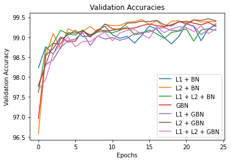

# Session 3 - MNIST 99.4% Test Accuracy using Ghost Batch Normalization(GBN) and Regularization (L1 and L2)

###	Objective:
Using your best Session2 Network, achieve an accuracy of **99.4%** on the **MNIST** dataset with the following constraints:

- 99.4% validation accuracy
- Less than **10k** Parameters
- Less than **25** Epochs
- No fully connected layers
- report findings:
   1. with L1 + BN
   2. with L2 + BN
   3. with L1 and L2 with BN
   4. with GBN
   5. with L1 and L2 with GBN

###	Solution: 
Below are the Code Iterations to target this problem. 

### Iteration 1 - Using GBN, L1 Loss, L2 Loss

[](https://colab.research.google.com/github/gmshashank/pytorch_vision/blob/main/MNIST/Session3/3_Regularization(GBN_BN_Dropout).ipynb)
[](http://nbviewer.jupyter.org/github/gmshashank/pytorch_vision/blob/main/MNIST/Session3/3_Regularization(GBN_BN_Dropout).ipynb)


-   #### Target
	-   Get the set-up right
	-   Set Transforms
	-   Set Data Loader
	-   Set Basic Working Code
	-   Set Basic Training  & Test Loop
	-   Get the basic skeleton right. We will try and avoid changing this skeleton as much as possible 

-   #### Results:
	-   Parameters: 10k (9,920)
	-   Best Training Accuracy: 99.27%
	-   Best Test Accuracy: 99.46% (GBN)

-   #### Analysis:
	-   The best model behaviour(stable and higher accuracy) can be seen with the Base model with Ghost Batch Normalizations followed by Base model with just L2 regularization 
	-   L2 regularization working better than L1 regularization in this case


###	Model design

```
----------------------------------------------------------------
        Layer (type)               Output Shape         Param #
================================================================
            Conv2d-1           [-1, 16, 26, 26]             144
              ReLU-2           [-1, 16, 26, 26]               0
       BatchNorm2d-3           [-1, 16, 26, 26]              32
           Dropout-4           [-1, 16, 26, 26]               0
            Conv2d-5           [-1, 16, 24, 24]           2,304
              ReLU-6           [-1, 16, 24, 24]               0
       BatchNorm2d-7           [-1, 16, 24, 24]              32
           Dropout-8           [-1, 16, 24, 24]               0
            Conv2d-9           [-1, 16, 24, 24]             256
             ReLU-10           [-1, 16, 24, 24]               0
        MaxPool2d-11           [-1, 16, 12, 12]               0
           Conv2d-12           [-1, 16, 10, 10]           2,304
             ReLU-13           [-1, 16, 10, 10]               0
      BatchNorm2d-14           [-1, 16, 10, 10]              32
          Dropout-15           [-1, 16, 10, 10]               0
           Conv2d-16             [-1, 16, 8, 8]           2,304
             ReLU-17             [-1, 16, 8, 8]               0
      BatchNorm2d-18             [-1, 16, 8, 8]              32
          Dropout-19             [-1, 16, 8, 8]               0
           Conv2d-20             [-1, 10, 6, 6]           1,440
             ReLU-21             [-1, 10, 6, 6]               0
      BatchNorm2d-22             [-1, 10, 6, 6]              20
          Dropout-23             [-1, 10, 6, 6]               0
           Conv2d-24             [-1, 10, 6, 6]             900
             ReLU-25             [-1, 10, 6, 6]               0
      BatchNorm2d-26             [-1, 10, 6, 6]              20
          Dropout-27             [-1, 10, 6, 6]               0
        AvgPool2d-28             [-1, 10, 1, 1]               0
           Conv2d-29             [-1, 10, 1, 1]             100
================================================================
Total params: 9,920
Trainable params: 9,920
Non-trainable params: 0
----------------------------------------------------------------
Input size (MB): 0.00
Forward/backward pass size (MB): 0.87
Params size (MB): 0.04
Estimated Total Size (MB): 0.91
----------------------------------------------------------------
```




### Miss-classified Images for GBN

_missclassified_images.jpg)
	
---
